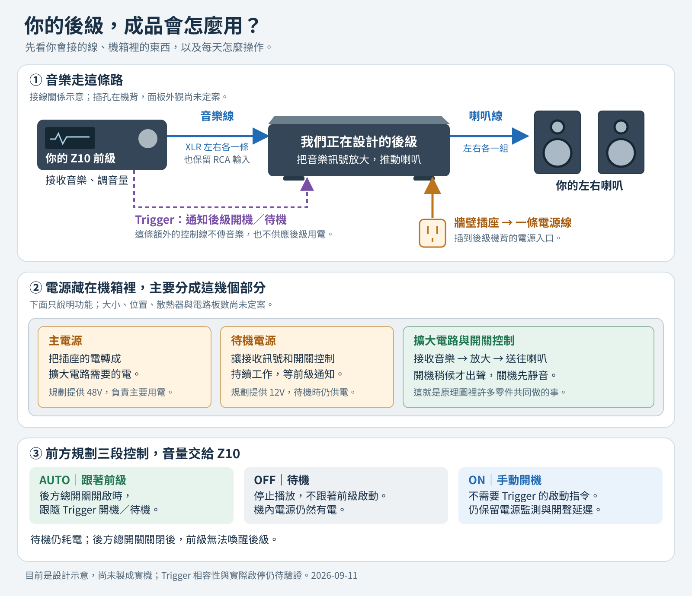
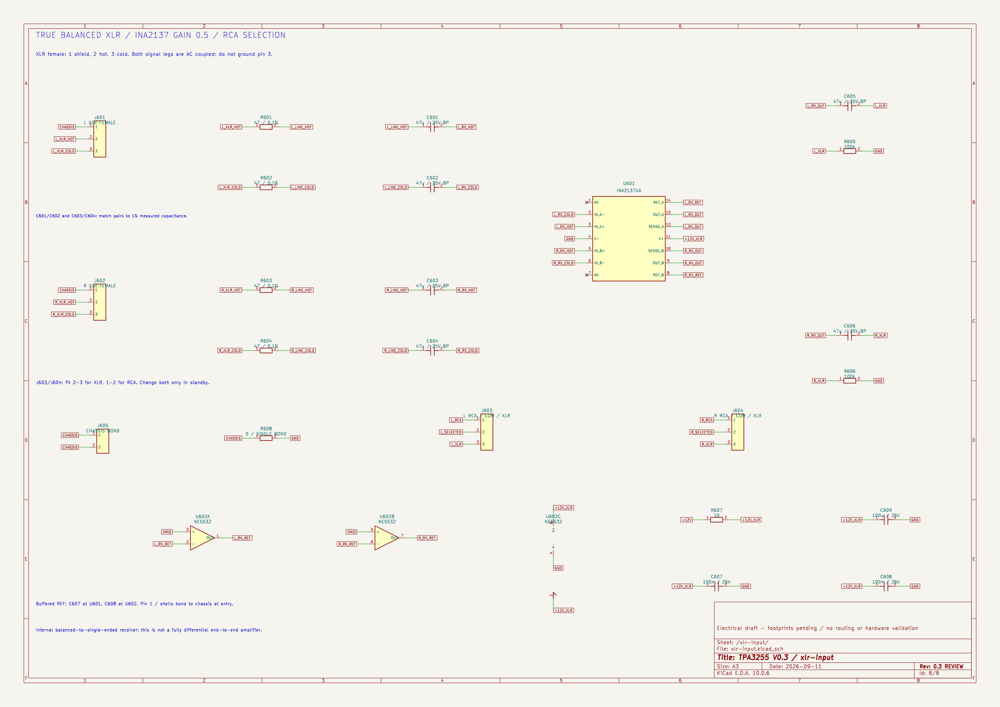

# TPA3255 DIY 立體聲後級

使用 TI TPA3255 自畫電路與 PCB，搭配材料選用、3D 機構與量測，完成一台練習機／備用後級，記錄 AI 協作過程供課堂展示。

## 先看成品怎麼用

**Z10 送出音樂 → 這台後級放大 → 左右喇叭發聲。** 音量由 Z10 調整；後級機內自帶電源，機背只接一條市電電源線，另外可接 Trigger 跟隨前級開機／待機。



[白話說明與放大圖](docs/使用方式圖解.md)。這是功能與使用方式示意，外觀、內部位置及尺寸尚未定案；目前尚無實機。

## 目前進度

V0.3 已加入 **XLR 平衡輸入並保留 RCA**，搭配濾波後回授（PFFB）、四顆 Coilcraft MA5172-AE，以及隔離 Trigger、自動啟停與 48V 功率電源開關。八頁 KiCad 原理圖及簡化模型已檢查。已開始 PCB 零件配置；以 2×50W / 8Ω 為第一階段目標，尚無完成的板子或實測。

XLR 使用 INA2137 差動接收器，依 Z10 的 XLR／RCA 電平匹配音量。第一版由左右聲道跳線選擇輸入，切換前先進入待機。

整機已改為 **機內電源、機背一條市電線**：規劃單一 IEC 入口，機內分別供應 48V 主電源與 12V 待機電源。Trigger 關機只停止功率級供電，兩組 AC/DC 與 12V 支路仍有電。電源模組已有候選，交流保護、12V 入口保護、配線及熱驗證尚待完成；Z10 Trigger 的電壓、極性與帶載能力仍需實測。

## PCB 第一版配置


**[看 PCB 配置與中文說明](electrical/pcb-draft/README.md)** · [檢查結果](electrical/pcb-draft/validation.md)

已放入 180 個元件與 4 個固定孔，暫抓 22×16 公分，尺寸與料件仍需調整。**尚未走線，不能送廠製作。** 先補電源保護、定料與散熱，再細調位置和走線。

## 電路圖



**[查看 V0.3 八頁原理圖](electrical/v03/README.md)** · [放大 XLR 圖](electrical/v03/preview/tpa3255-v03-xlr-input.svg) · [下載 PDF](electrical/v03/preview/tpa3255-v03.pdf) · [中文設計說明](docs/V0.3_設計說明.md) · [驗證報告](electrical/v03/validation.md)

## 整機電源與機箱


[電源架構、模組候選與待辦](electrical/system-power/README.md) · [機箱製作方式](mechanical/機箱選擇.md)

採現成鋁機箱＋客製前後面板的方向，需重新容納機內電源、熱路徑與市電配線。機箱尚未定案；[原 V0.1 空間圖](mechanical/README.md) 保留為歷史占位，不代表目前整機尺寸。

## 文件

| 文件 | 用途 |
|---|---|
| [使用方式圖解](docs/使用方式圖解.md) | 先看 Z10、後級、喇叭怎麼連接，以及電源和開關怎麼用 |
| [PCB 配置草案](electrical/pcb-draft/README.md) | 真正 KiCad 板檔、180 元件初步配置、中文預覽與待辦 |
| [機內電源架構](electrical/system-power/README.md) | 單一市電入口、48V／12V 模組候選、保護接地與待機 |
| [V0.3 電路設計](docs/V0.3_設計說明.md) | 電感選型、回授、Z10 匹配與 Trigger 啟停 |
| [PCB 設計要求](docs/V0.3_PCB設計要求.md) | 供電、接地、取樣與元件配置要求 |
| [V0.2 電路設計](docs/V0.2_電路設計.md) | 歷史基線：手動控制、未加 PFFB |
| [音質改善評估](docs/V0.2_音質改善評估.md) | 回授、電感、供電與輸入級的改善優先順序 |
| [BOM 草案](electrical/v03/bom-draft.csv) | V0.3 電路元件；封裝候選另列於 PCB 草案，尚未回填定案 |
| [V0.1 設計規格](docs/V0.1_設計規格.md) | 系統、選材條件與測試流程 |
| [電路設計筆記](docs/01_電路設計.md) | 已修正的腳位、供電與設計注意事項 |
| [功率估算](docs/V0.1_功率估算.md) | 可重算的需求情境 |
| [原始規劃](docs/00_專案總覽.md) | 歷史成本與構想，待重核 |
| [接班進度](HANDOFF.md) | 下一步與驗證程度 |
| [拆分紀錄](MIGRATION.md) | 舊版本與歷史來源 |

## 下一步

補齊 12V 入口保護與交流入口／總開關選型，依機內電源的散熱需求重排機箱。同時完成回授穩定性、真實運放與電源開關的進一步驗證，核對 Trigger 介面、剩餘料件及封裝，再確定 PCB 板形、佈局和散熱器。

重新產生計算報告：

```sh
python3 tools/power_budget.py > docs/V0.1_功率估算.md
```

預覽更新方式見 [看圖說明](mechanical/README.md)。
Purifi 主力機位於 [獨立專案](https://github.com/ewinkuo1-sudo/diy-purifi-amplifier)，本專案的檔案與測試不依賴它。

## License

MIT（沿用來源專案的授權聲明）；衍生自 KiCad 的獨立封裝另依[封裝庫授權](electrical/pcb-draft/Placement.pretty/README.md)。
