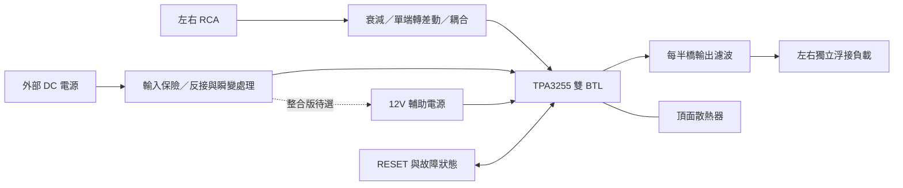

# TPA3255 V0.1：第一版設計基線

日期：2026-09-10。狀態：架構草案；尚無完成的原理圖、PCB 或實測。

## 目的與範圍

以 AI 協作完成電路、材料選用、PCB 與機構設計，保留查核、計算及改版過程供課堂展示。本專案完成 TPA3255 立體聲樣機，獨立管理規格、機構與驗證。

期限、預算、焊接設備與量測儀器尚未確定。以下為可修改的工程假設，不表示已核准採購。

| 項目 | V0.1 決定／假設 | 驗證方式 |
|---|---|---|
| 輸出 | 雙聲道 BTL；先以 8Ω 電阻負載測試，再評估 4Ω | 原理圖、假負載量測 |
| 主電源 | 外接 48V DC 為設計候選；初次測試使用符合工作範圍的較低電壓限流電源 | 實測啟動、負載瞬變及掉電 |
| 輔助電源 | 12V 供 VDD/GVDD；初次除錯可獨立供應，整合版再定 DC/DC | 供電順序與紋波量測 |
| 第一階段功率 | 暫定 2×50W / 8Ω、1kHz；此為設計目標，非現有性能 | 記錄雙聲道驅動、失真門檻與持續時間 |
| 輸入 | 優先立體聲 RCA、單端轉差動；XLR 留作後續選項 | 確認 Z10 輸出設定及輸入級 headroom |
| 電路基礎 | TI EVM 為參考，自畫原理圖並記錄修改理由 | 逐網核對，不能只比元件值 |
| PCB | 四層為初步選擇，板形尚未固定 | 疊構、回流、成本與機構共同審查 |
| 機構 | 外接電源；金屬機殼候選、獨立頂面散熱器 | 零件尺寸、固定力、熱與線材空間 |

50W 目標的失真驗收暫以 THD+N ≤1% 為上限；若儀器無法量測，結果只能記為輸出電壓與波形，不能宣稱已通過失真驗收。頻響、噪音、串音與溫升的驗收值需待量測設備盤點後凍結。

## 系統方塊圖

BTL 的兩個喇叭端均為輸出端，不能把負端當訊號地。上電檢查單必須指定差動量測方法；不可把接地式示波器地夾接到任一橋式輸出端。

## 設計順序

1. 完成元件腳位／封裝與原廠原理圖的人工逐項核對。
2. 畫 power、input、amplifier/filter、control 四個原理圖區塊。
3. 決定前端衰減與轉差動增益；Z10 最大輸出尚需原廠核對，不能直接當晶片容許輸入。
4. 決定 LC 拓撲和每聲道電感／電容接法，再計算 4Ω、8Ω 響應；不能只用單一 LC 截止頻率代表完整 BTL 電路。
5. 鎖定電感、接頭、電容與散熱器料號，取得尺寸／3D 模型後固定板形。
6. 完成 ERC、PCB 回流與散熱審查、DRC；之後才輸出製造檔。

## 零件選用條件（尚非採購 BOM）

| 區塊 | 已知需求 | 尚待選定 |
|---|---|---|
| 功率 IC | TPA3255 DDV，頂面散熱 | 完整訂購料號、授權供應商、封裝驗證 |
| 前端 | 參考 EVM 的 NE5532 架構 | 供電、偏壓、共模範圍、輸出擺幅、阻容值 |
| LC 電感 | 依峰值電流、紋波、DCR、溫升與偏磁後電感量選 | 材質、型號、尺寸；不能以標稱飽和電流單獨決定 |
| 輸出電容 | 依完整濾波拓撲及工作電壓選 | 容值、耐壓、介質與紋波能力 |
| 去耦／bulk | 依局部迴路與負載需求配置 | MLCC 直流偏壓降額、bulk ESR／紋波、壽命 |
| 12V 支路 | 供應 IC 及選定前端／控制電路 | 最大耗流、DC/DC 輸入瞬變耐受與雜訊 |
| DC 接頭／保險 | 依完整電源預算與湧入電流選 | 額定電流、線徑、熔斷特性及接觸電阻 |
| 散熱器 | 頂面接觸、固定與電氣隔離需求 | 熱阻、導熱介面及實際高度 |

## 3D 第一版

`../mechanical/enclosure-concept.scad` 是參數化空間模型：220×180×70mm 外形與 140×100mm PCB 均為占位假設。模型只有機殼、板區、散熱區；未定接頭開孔、螺柱、通風與加工公差，不能直接加工。塑膠列印可用於尺寸樣件，功率散熱需另行設計。

## 量測與作業證據

依序留下：斷電檢查 → 電源與 RESET → 無訊號假負載 → 小訊號 → 分階段提高輸出 → 溫升與掉電 → 修正。每筆記錄包含設備、接法、負載、電源、輸入、結果、照片及判定。通過假負載測試之前，不接 BE-718。

`../tools/power_budget.py` 可重算理想電氣需求；結果不是 SPICE、不是晶片功率保證，也不包含開關紋波。輸出見 `V0.1_功率估算.md`。

## 參考

- [TI TPA3255 datasheet，SLASEA8A](https://www.ti.com/lit/ds/symlink/tpa3255.pdf)：§6、§7.3–7.5、§10–12。
- [TI TPA3255EVM User’s Guide，SLOU441](https://www.ti.com/lit/ug/slou441/slou441.pdf)：輸入級、原理圖、BOM 與佈局；作為既有參考設計，不照抄全部功能。

查閱日：2026-09-10。所有未附原廠條件的數值均屬本案假設或計算。
