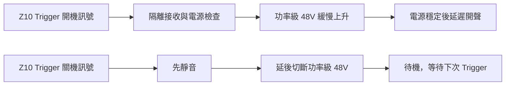
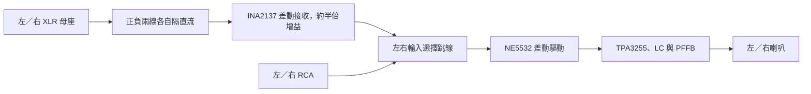

# V0.3：XLR／RCA、音質改版與前級 Trigger 自動啟停

2026-09-11。依使用者要求加入 XLR，保留 RCA，由設計端選擇電感、依 Z10 前級匹配輸入，加入 Trigger 自動開關機，並採用前次音質改善建議。此版為原理圖草案，尚無 PCB 或實機驗證。

[八頁電路圖與 PDF](../electrical/v03/README.md) · [驗證結果](../electrical/v03/validation.md) · [BOM 草案](../electrical/v03/bom-draft.csv) · [PCB 設計要求](V0.3_PCB設計要求.md)

## 使用時會怎麼動作

關機是進入待機：切斷板上功率級的 48V 供電；外部 48V 電源供應器及 12V 待機／類比支路仍有電。總耗電待實測。完全斷電仍由上游總電源處理。這張 PCB 不切換市電。

J302 接三段 AUTO／OFF／ON 開關。AUTO 跟隨前級；OFF 為開關中心斷開；ON 手動開啟，但仍受電源監測與延遲控制。開關連接腳為 1=AUTO、2=公共端、3=ON。

## 電感已選擇：四顆 Coilcraft MA5172-AE

| 項目 | 原廠資料／本版用途 |
|---|---|
| 位置與數量 | L1–L4，共四顆，BTL 每聲道兩顆 |
| 電感量 | 10µH，資料表容差 ±1µH |
| 直流電阻 | 25°C 最大 26mΩ；取代 V0.2 模型的假設 50mΩ |
| 電流與溫升 | 6.1Arms 對應 20°C 溫升、8.2Arms 對應 40°C 溫升，依原廠測試條件 |
| 電感下降電流 | 25°C、45A 對應典型 10% 電感下降；不能當成 45A 連續額定 |
| 機械空間 | 本體最大直徑 28.6mm、厚 12.3mm，腳距 10.0±0.5mm，線徑最大 1.07mm |

來源：[Coilcraft MA5172/3-AE、PA6331-AE，Doc 943-1，2023-04-11](https://www.coilcraft.com/getmedia/5fb1a3ea-b3b6-4ae7-89c3-2a4c68c350e4/ma5172.pdf)。

選它是因為有 Class-D 應用、電流與機械資料可核對。50W/8Ω 的喇叭電流為 2.5Arms；加入本版簡化的開關紋波估算後約 2.62Arms，低於上述溫升參考電流。銅損估算不含磁芯損耗，實際 450kHz、偏磁及封閉機箱溫升仍要量測。

7µH 的 MA5173-AE 及 15µH 的 PA6331-AE 屬不同濾波設計，不能直接代換。四顆電感需一起考慮容差、左右對稱、固定方式及 PCB 回路；不把標稱電流較大當作音質保證。TPA3255 也要求過流點仍保有足夠電感量，需檢查高溫與保護條件。[TPA3255 §7.3、§9.4](https://www.ti.com/lit/ds/symlink/tpa3255.pdf)

## 回授與輸入級一起修改

已加入四路同臂 PFFB：`SPK_A→SUM_A`，B／C／D 同理。採 TI TPA3255 範例的起始參數：33kΩ 回授、2.7kΩ 輸入加總電阻、220pF／220pF／10kΩ 高頻支路，輸出阻尼改為 220nF＋1Ω；運放回授電容改為 330pF。加總點位於送往晶片的耦合電容之前。[TI SLAA788A，Figure 2、Table 1](https://www.ti.com/lit/an/slaa788a/slaa788a.pdf)

本板保留 RCA 輸入與兩級 NE5532 差動轉換，第一級改為 11.5kΩ 輸入／10kΩ 回授，第二級 10kΩ／10kΩ。這是因應 PFFB 降低增益後重新匹配，不是直接套用 TI 整張 EVM。RCA 端約 100kΩ 並聯 11.5kΩ 的中頻負載，尚需核對 Z10 的實際帶載表現。新增的 XLR 接收器與 RCA 共用後段驅動級。

原廠 Z10 規格標示 RCA 2.5Vrms、XLR 5Vrms，均為 0dBFS。模型下達到 50W/8Ω 需要約 2.126Vrms RCA 或 4.268Vrms XLR 差動訊號，保留名義輸入餘裕；滿刻度輸入仍可能超過 50W，這不是硬性功率限制。[Eversolo DAC-Z10 官方手冊，P14](https://www.eversolo.com/files/DAC-Z10%20User%20Manual-v1.0.pdf)

在無限頻寬功率級的簡化模型中，20kHz 相對 1kHz 為 4Ω 約 −0.28dB、8Ω 約 +0.30dB；這只是設計分析。加入自訂 100kHz 功率級極點也重新計算，供敏感度比較。這兩種模型都沒有真正的 PWM 延遲、運放頻寬／失真／噪聲，因此不能用來宣稱音質或迴路穩定性已通過。

## XLR 平衡輸入怎麼接

J601／J602 是左右 XLR 母座，接點編號依插座原廠圖面核對，不依正面目視猜測：1 為屏蔽、2 為正訊號、3 為負訊號。2、3 腳分別接到 U601 INA2137UA 的正／負輸入，平衡接收後轉成單端，再送既有 NE5532 差動驅動級。這項設計主要處理兩條訊號線共同受到的干擾；是否比 RCA 安靜要看訊源、配線、PCB 與量測。

U601 以 SOIC-14 實體腳位繪製；Sense 接自身輸出，採原廠 0.5 倍組態。REF 需要低阻抗，故新增 U602 的兩個 NE5532 跟隨器，分別驅動左右 REF，避免直接負載原本 VMID 分壓器。U601／U602 使用獨立的 10Ω／100µF 濾波支路及各自 100nF 去耦。[INA137／INA2137，腳位圖與 Figure 1、REF 說明](https://www.ti.com/lit/ds/symlink/ina137.pdf)、[NE5532 單位增益工作與電源要求](https://www.ti.com/lit/ds/symlink/ne5532.pdf)

兩條 XLR 訊號線各串 47Ω／0.1% 與 47µF／25V 無極性電容，阻擋單電源偏壓流入前級。C601/C602、C603/C604 各成一對，需挑選實測電容量差異不超過 1% 的料件；一般電解電容標示 ±20% 並不能保證配對。接收器輸出再以 C605／C606 隔直流，100kΩ 提供選擇器前的直流回路。完整阻容值已納入模型，未把電容視為短路。

J603／J604 每聲道各一個三腳選擇端：均接 **2–3 為 XLR（預定初裝設定）**，均接 **1–2 為 RCA**。每個端子只裝一個跳線帽，兩種訊源不混接；先將 J302 設為 OFF 待機後再改設定。圖面中的接頭不會在 KiCad netlist 自動短接，模擬明確依所選模式閉合對應接點。面板切換、切換靜音及接頭確切料號仍待後續設計。

XLR pin 1 與金屬外殼在入口接機殼，J605 是機殼連接點；R608 是訊號 GND 與 CHASSIS 的單一 0Ω 連接。RCA 插座採絕緣安裝，避免出現額外機殼接點。Trigger 的隔離回線仍獨立，不接到這個屏蔽網路；PCB 須讓屏蔽回流避開安靜的輸入地。

搭配 Z10 時，依其手冊將 Output Port 選為 **XLR Only**，XLR Polarity 使用正常極性；使用 RCA 時則選 RCA 輸出。先從低音量開始調整。[Z10 官方手冊，P22](https://www.eversolo.com/files/DAC-Z10%20User%20Manual-v1.0.pdf)

XLR 與 RCA 的十二組負載／極點模型及兩組共模測試已通過；以 Z10 標示的 5／2.5Vrms 輸入比較，20Hz、1kHz、20kHz 的輸出差異均小於 0.1dB。模型使用理想內部電阻比與運放，不代表 INA2137 的真實 CMRR。實際電容匹配、訊源阻抗、共模範圍、12V 低電壓下的最大擺幅、偏壓建立／切換爆音、ESD／射頻干擾及失真仍需檢驗。

## Trigger 的規格邊界

Z10 官方手冊確認有 Trigger IN／OUT，官方韌體說明也列出聯動關機功能。查得的官方手冊沒有完整列出輸出電流能力、接點極性或電平容差；本版以 **12V 名義、9–15V 設計輸入範圍、tip 正／sleeve 負** 作為待實測的介面假設，沒有套用其他 Eversolo 型號的 150mA 額定。[Z10 官方手冊](https://www.eversolo.com/files/DAC-Z10%20User%20Manual-v1.0.pdf)、[官方下載與韌體紀錄](https://www.eversolo.com/en/downloads/dac-z10)

U301 VOS618A-3T 光耦接收訊號，6.8kΩ 限流，12V 時 LED 名義約 1.6mA；1N4148 保護 LED 反向電壓。`TRIG_RETURN` 不接板上 GND 或機殼，插座也須絕緣安裝，避免多出接地回路。這是訊號隔離；不把元件的隔離測試額定當成整板安規認證。[Vishay VOS618A](https://www.vishay.com/docs/83465/vos618a.pdf)

實機接線前需確認 Z10 Trigger 的電壓、正負極、待機電平，以及接上約 1.6mA 負載後能否保持正常。這是硬體相容性待辦，不是已完成的測試。

## 電源監測與實際斷開功率電源

U303 TPS3808 監測 12V，名義門檻 11.22V；Trigger 和 12V 正常後才產生 `AUX_GOOD`。U304／D302／R310／C304／U305 提供掉電保持：關閉請求先撤除音訊允許，再延後撤除 eFuse 使能。保持時間需以實際邏輯閾值、二極體、漏電和電容確認，試算包絡不是保證規格。[TPS3808，SBVS050N，2026-08 修訂](https://www.ti.com/lit/ds/symlink/tps3808.pdf)、[SN74LVC1G17](https://www.ti.com/lit/ds/symlink/sn74lvc1g17.pdf)、[SN74LVC1G14](https://www.ti.com/lit/ds/symlink/sn74lvc1g14.pdf)

U401 TPS26631PWPR 切換 48V。設定約 4.5A 名義限流，依該型號還具有短時 2 倍電流支援；MODE 留空選擇過載鎖定。2.2µF 設定名義約 2.2 秒軟啟動。324kΩ／10kΩ 設定欠壓，412kΩ／10kΩ 設定約 50.64V 過壓切斷。供電以穩壓 48V、±2% 作為下一步電源選型要求。[TPS2663，SLVSE94G，§5、§6.5、§8](https://www.ti.com/lit/ds/symlink/tps2663.pdf)

PGOOD 與 AUX_GOOD 共同控制 U306，U306 再監測 PVDD 約 40.9V，電源良好後延遲約 1.03 秒釋放 RESET。不能只依靠 PGOOD：eFuse 本身的狀態、實際 PVDD 及輔助電源都要符合條件。正常關機的保持時間以 3.3V 待機電源仍正常為前提；突然失去全部供電時，是否無爆音仍需實測。

D401 選 STPS5H100B 作主電源反接阻擋，需核對 DPAK 散熱。未使用 eFuse 外接反向阻擋 MOSFET，也尚未完成輸入突波抑制與 ESD 測試；不能把 eFuse 功能列表當作本板全部已具備的保護。[STPS5H100 資料表](https://www.st.com/resource/en/datasheet/stps5h100.pdf)

TPA 的 FAULT／CLIP_OTW 保留供量測，沒有將 FAULT 直接接回 RESET，以免啟動時正常的 FAULT 低態造成循環重啟。晶片內建故障保護仍運作。eFuse 過載鎖定後須讓 Trigger 關閉足夠久、使 SHDN 確實下降，再重開；除錯先以 OFF 至少 2 秒作測試條件，實機再核定。

## 完成程度與下一步

- 已完成：八頁原理圖、XLR 差動接收與 RCA 選擇、PFFB 改版、電感選型、Z10 電平匹配、隔離 Trigger 接收、監測與主電源開關草案。
- 已檢查：ERC、接線群組、關鍵控制腳位、音訊 AC 簡化模型，以及開關機／缺電源／掉壓／Trigger 短脈衝／eFuse 鎖定的時序規格模型。
- 尚待：真實迴路與運放模型／實測、XLR 輸入匹配與偏壓暫態、Trigger 相容性、電源切換與電感熱、全部封裝和最終料號、保險絲協調、12V 輸入保護、PCB、噪聲／THD／EMI 量測。

目前不產生 Gerber 或製板訂單。下一階段先審查上述硬體限制並完成料件及封裝，才能凍結 PCB；V0.2 原理圖及數據保留為歷史基線。
