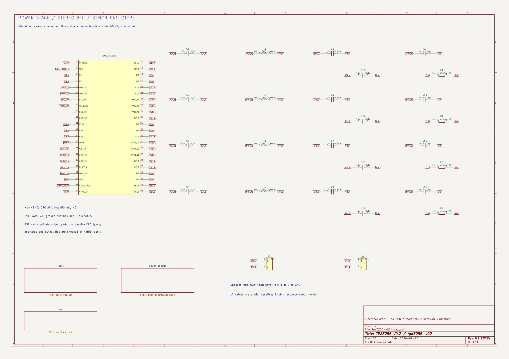
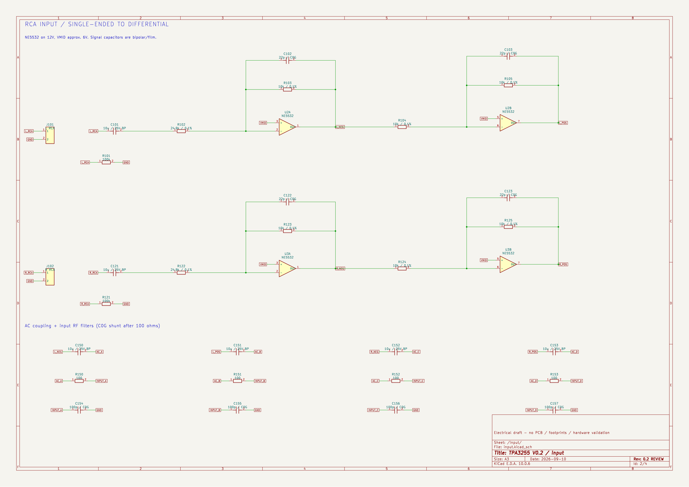
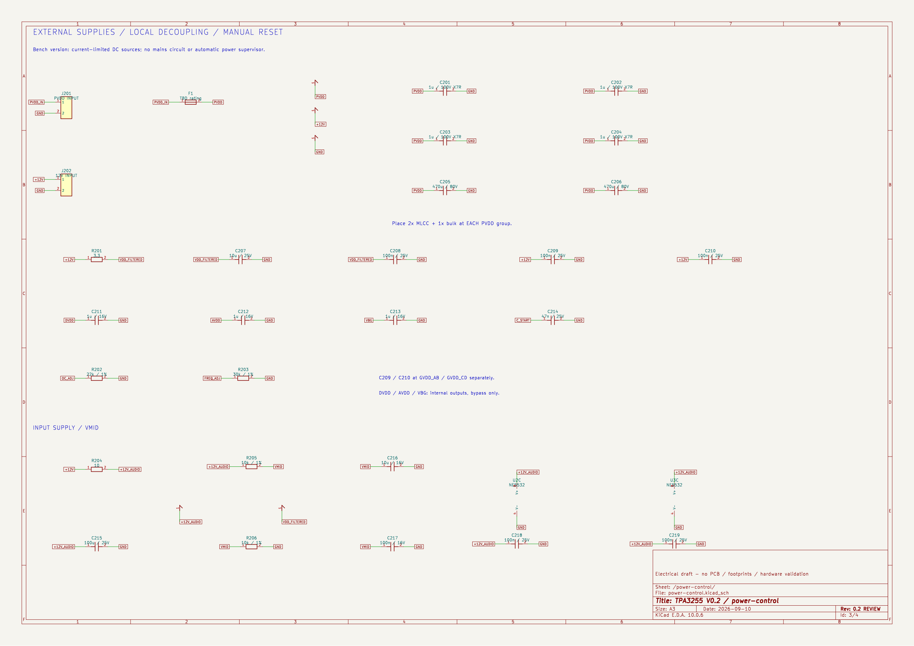
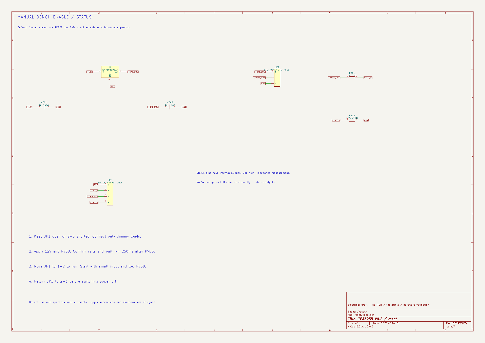

# TPA3255 原理圖：直接看圖

最新設計已移至 **[V0.3 八頁原理圖：XLR／RCA 與 Trigger](v03/README.md)**。以下保留 V0.2 歷史基線。

這裡是 V0.2 可編輯的 KiCad 電路草案，已通過 ERC 與接線群組核對，尚無 PCB 或實測。四頁屬於同一電路，全域網路名稱相同即相連。

**[下載四頁 PDF](preview/tpa3255-v02.pdf)** · [中文設計說明](../docs/V0.2_電路設計.md) · [驗證結果](validation.md) · [BOM 草案](bom-draft.csv)

## 1. 功率級與輸出濾波



[放大 SVG](preview/tpa3255-v02.svg)

## 2. RCA 輸入級



[放大 SVG](preview/tpa3255-v02-input.svg)

## 3. 供電與去耦



[放大 SVG](preview/tpa3255-v02-power-control.svg)

## 4. 手動啟停控制



[放大 SVG](preview/tpa3255-v02-reset.svg)

## 編輯與重現

用 KiCad 10 開啟 [tpa3255-v02.kicad_pro](tpa3255-v02.kicad_pro)，再開啟同名原理圖。`Project.kicad_sym` 與 `sym-lib-table` 已隨專案附上，不依賴另行下載的自訂符號。

檢查與輸出（在專案根目錄）：

```sh
python3 tools/verify_electrical.py
python3 tools/export_schematic.py
```

`verify_electrical.py` 讀取目前的原理圖，用 KiCad 匯出接線表，核對 `expected-connections.csv` 並產生 ngspice 輸入／LC 區塊模型、CSV 數據與報告。更改電路時需審查並更新預期接線表；不要為了通過檢查而直接接受未知連接。

`tools/build_schematic.py` 是本次初始圖面的產生器，重跑會覆寫四頁原理圖、自訂符號、預期接線表與專案檔。若已在 KiCad 手動編輯，平時使用上面的驗證／匯出指令即可。

`export_schematic.py` 使用 `kicad-cli` 匯出四頁 PDF／SVG，整理 SVG 行尾空白，再用 `rsvg-convert` 產生寬 2400 像素的 PNG。需安裝 KiCad 與提供 `rsvg-convert` 的 librsvg；圖面更新時執行一次即可同步首頁預覽。
