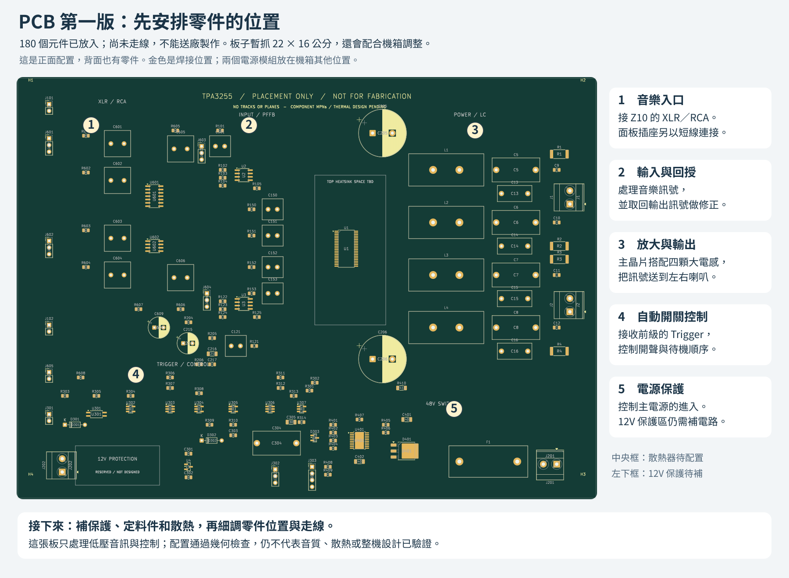

# PCB 第一版：零件配置草案

已開始畫真正的 KiCad 電路板檔案。本階段先安排零件位置和空間，**尚未走線，不能送廠製作**。板子暫抓 220×160 mm，機箱與散熱器仍需配合調整。



[放大中文圖解](preview/placement-explained.svg) · [正面原始預覽](preview/top.png) · [背面原始預覽](preview/bottom.png) · [檢查結果](validation.md)

## 目前這張板包含什麼

- 180 個電路元件與 4 個暫定 M3 固定孔，保留原理圖接線資料。
- 左側接前級；中間放輸入處理、回授與功率晶片；右側安排四顆電感與喇叭輸出；下方安排 Trigger 與主電源開關。
- 主晶片頂部的散熱器、12V 入口保護各有空間標記。標記是配置預留，不代表完成 3D 干涉檢查或電氣隔離設計。
- 暫用 4 層、1.6 mm 板厚做空間研究；尚未核定製程、銅厚、介質、線寬、過孔或地平面，沒有畫任何銅箔走線／覆銅。
- 只包括音訊與低壓控制。兩個 AC/DC 電源、交流入口與市電線束放在機箱其他位置，不在這張板上。

分區和現有間距只是起點。高電流回路、去耦過孔、回授取樣、背面元件可裝配性及散熱器固定仍要細調；目前不能以「放得下」判定可用於實際功率輸出。

## 封裝核對與尚未定料的項目

[placement.csv](placement.csv) 每個元件一列，記錄初始封裝、正／背面、位置和來源封裝檔 SHA-256；它是生成結果，手動修改板檔後需同步更新。`package_candidate` 表示已依下列原廠資料核對封裝類型及腳序，但未完成製造放行；`provisional` 表示暫用的尺寸／封裝占位，未選定相應實際料號。

| 部分 | 本次處理與依據 |
|---|---|
| TPA3255 | 使用 DDV 44 腳頂面散熱封裝；PCB 沒有額外的第 45 腳底部散熱焊盤。依 [TI 原廠資料，封裝及 §12](https://www.ti.com/lit/ds/symlink/tpa3255.pdf)。散熱器尺寸與接觸壓力未定。 |
| 主電源開關 | TPS26631 使用 PWP0020T 對應的 HTSSOP-20 與 2.96×2.96 mm 阻焊開口版本，底部第 21 腳接 GND；散熱銅面／過孔仍未設計。[TI TPS2663](https://www.ti.com/lit/ds/symlink/tps2663.pdf) |
| XLR 接收與運放 | INA2137UA 用 SOIC-14；NE5532 暫選 SOIC-8（D 封裝方向，完整訂購料號待定）。[INA2137](https://www.ti.com/lit/ds/symlink/ina137.pdf)、[NE5532](https://www.ti.com/lit/ds/symlink/ne5532.pdf) |
| 監測／邏輯／穩壓 | TPS3808 DBV 用 6 腳 SOT-23；LVC1G14／17 DBV 用 5 腳 SOT-23；TLV760 DBZ 為 3 腳且 1=OUT、2=IN、3=GND。[TPS3808](https://www.ti.com/lit/ds/symlink/tps3808.pdf)、[LVC1G14](https://www.ti.com/lit/ds/symlink/sn74lvc1g14.pdf)、[LVC1G17](https://www.ti.com/lit/ds/symlink/sn74lvc1g17.pdf)、[TLV760](https://www.ti.com/lit/ds/symlink/tlv760.pdf) |
| Trigger 光耦 | VOS618A 用 SSOP-4，依 [Vishay 外形與腳序](https://www.vishay.com/docs/83465/vos618a.pdf)。隔離兩側仍須在走線時保持分開。 |
| 二極體 | D303 的 BAT54 由邏輯兩腳符號改成實體 1=A、2=NC、3=K，陰極接 AUX_GOOD，功能方向不變。[Nexperia BAT54](https://assets.nexperia.com/documents/data-sheet/BAT54.pdf)。D401 採 DPAK，1=A、2=K／散熱片、3=NC，[ST 資料](https://www.st.com/resource/en/datasheet/stps5h100.pdf)。D301／D302 的軸向封裝另依本專案 A=1、K=2 重新編號，陰極帶位置不變。 |
| 電感 | 自訂 MA5172-AE 占位採原廠 28.6×12.3 mm 包絡與名義 10 mm 腳距。**1.4 mm 成品孔、3 mm 焊盤是本次暫定值**，不是原廠建議；腳距 ±0.5 mm、線徑最大 1.07 mm 仍須配合孔公差、裝配及電流核定。[Coilcraft 外形圖](https://www.coilcraft.com/getmedia/5fb1a3ea-b3b6-4ae7-89c3-2a4c68c350e4/ma5172.pdf) |
| 電阻／電容／保險絲 | 封裝僅估空間。0805、1206 或 2512 尺寸不能保證耐壓、功率、電容偏壓特性或誤差；所有實際料號需補齊。無極性電容用無正負標記的專用占位；F1 與座尚未定料，圖中外形／孔距不對應已核定的產品。 |
| 插座與線束 | XLR、RCA、Trigger 和面板控制暫以板端排針占位，**不是面板插座的實際腳位／孔位**；尚需選有防呆／固定的接頭並製作線束對照。主電源與喇叭端子也只選封裝候選，額定與料號未核定。 |

## 開啟與修改

KiCad 10 開啟 [tpa3255-placement.kicad_pro](tpa3255-placement.kicad_pro)，再開同名 PCB；也可直接開 [板檔](tpa3255-placement.kicad_pcb)。原理圖維持在 [V0.3](../v03/README.md)。

本階段封裝候選由 `placement.csv`／生成器管理，**尚未回填原理圖的 Footprint 欄位**，避免把占位當成定案。正式轉入原理圖與 PCB 同步流程時，先定料、回填封裝、核對多單元符號對應，再審查「由原理圖更新 PCB」的差異。不能直接重新生成後覆蓋人工佈局。

```sh
python3 tools/verify_pcb_draft.py
python3 tools/export_pcb_draft.py
```

`tools/build_pcb_draft.py` 由最新原理圖產生初始配置，預設拒絕覆寫已有板檔；`--force` 會丟棄人工 PCB 修改。這不是佈線工具。背面預覽從背面看，左右相對正面翻轉。

PCB 草案完成後的下一步：先補 12V 保護並核定料件／散熱器，再縮短功率回路與取樣路徑、配置地平面並逐區走線。製板前仍須完整 DRC、電路與熱設計審查；試作板再量測音質、穩定度、啟停與溫升。沒有輸出 Gerber 或下單。

本機 KiCad 10.0.6 Python API 的部分舊通孔封裝寫出時會遺漏阻焊開口，生成器已補回，檢查工具會重新讀取板檔逐腳核對。這項工具相容處理不改變腳號或接線。專案自訂庫的來源與授權見 [Placement.pretty/README.md](Placement.pretty/README.md)。
