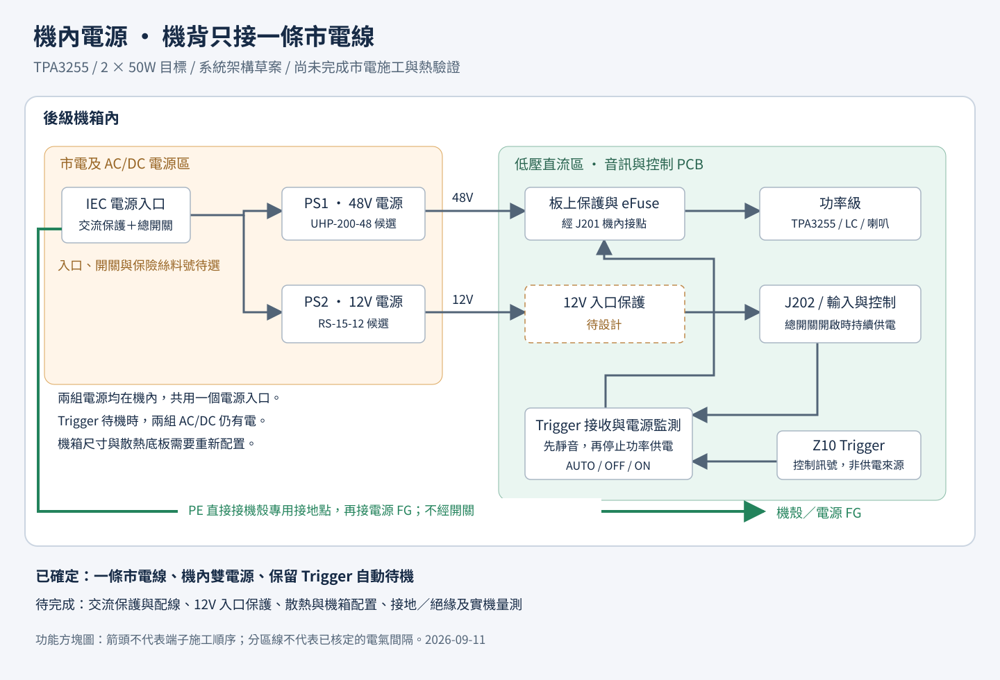

# 機內電源：一條市電線的整機架構

2026-09-11。使用者已確定成品採機內電源，機背只接一條市電電源線。以下是整機架構與電源候選，尚未完成市電配線施工圖、交流保護選型、機構熱驗證或採購。

[放大向量圖](power-system.svg) · [低壓音訊／控制原理圖](../v03/README.md) · [機箱規劃](../../mechanical/機箱選擇.md)

## 已確定的使用方式

- 機背規劃單一 IEC C14 三芯電源入口與總電源開關，前面維持 AUTO／OFF／ON 控制；電源線型式與額定隨最終入口及使用地核定。
- 機內兩組隔離式 AC/DC 電源共用這個市電入口，分別提供 48V 主電源與 12V 待機／類比電源。
- J201、J202 改為機內供電接點，成品後板不提供兩個外接 DC 電源孔。
- 後方總電源開啟後，兩組電源持續工作；AUTO 跟隨 Z10 Trigger，板上 eFuse 控制功率級的 48V。
- Trigger 關閉先靜音，再停止功率級供電。兩組 AC/DC 與 12V 類比／控制仍有電，所以仍有待機耗電；不宣稱低於 0.5W 或零耗電。
- 後方總開關關閉會撤除兩組 AC/DC 的輸入，Trigger 無法喚醒。入口、開關上游與殘存電荷仍需按市電設備處理；維修先拔除電源線。

本次採現成隔離式 AC/DC 模組整合，音訊 PCB 維持低壓直流電路。尚未加入以 Trigger 關閉主 AC/DC 的市電繼電器，也未使用電源模組遙控功能。

## 第一輪候選

候選用於容量、空間與介面評估，確切料號須通過降額、保護協調、供貨與價格確認後才列入採購清單。

| 位置 | 候選 | 核對到的原廠資料 |
|---|---|---|
| PS1 主電源 | MEAN WELL UHP-200-48，標準型 | 48V、4.2A、201.6W；90–264VAC；本體 194×55×26 mm；無風扇，須依安裝方式與溫度降額 |
| PS2 輔助電源 | MEAN WELL RS-15-12 | 12V、1.3A、15.6W；85–264VAC；本體 62.5×51×28 mm；螺絲端子，另需防觸碰罩與固定空間 |

來源：[UHP-200 原廠規格，2025-08-01](https://www.meanwell.com/upload/pdf/UHP-200%28R%29/UHP-200-spec.pdf)、[RS-15 原廠規格，2026-04-10](https://www.meanwell.com/Upload/PDF/RS-15/RS-15-SPEC.PDF)。上述範圍涵蓋本案暫以台灣 110V／60Hz 為評估條件；不表示整機已完成全輸入範圍驗證。

UHP-200 的標準型與帶 R 選配型不可混淆；本案不依賴 DC OK 或冗餘選配。其安裝頁要求用底部鋁板支援指定曲線，建議板為 **300×300×3 mm**，亦提供無額外鋁板時的降額曲線。不能把模組本體尺寸當成完整散熱占位，也不能直接把任何機箱側散熱片當作等效散熱底板。

## 容量與保護需要對上的地方

兩聲道各 50W、功率級效率假設 90% 時，主功率需求約 111W；先另留 5W 給主 DC 路徑損耗，約 116W，增加 25% 容量預留後約 145W。12V 支路另暫編 5W，約 0.42A。這些是選型假設，非最大值驗證或實測；與舊版把輔助耗電合併在 48V 預算的估算方式區分。

兩個候選的名義容量可作第一輪評估，但仍要核對低輸入電壓、箱內高溫及動態負載。這個配置不代表可以保證兩聲道各 100W。

- PS1 調整目標 48.0V，不任意調到最高輸出。板上 eFuse 仍負責主 DC 過壓、欠壓與啟停。電源自身的過壓動作範圍不能替代功率晶片的保護。
- 目前 eFuse 名義限流約 4.5A，PS1 額定為 4.2A；正常目標負載低於兩者，但故障時哪一級先動作及是否反覆重啟尚未驗證，需協調限流、板上 F1 與電源保護。
- PS2 調整目標 12.0V。**J202 前的反接／過壓／過流保護仍待設計**；現有 TPS3808 只監測供電及靜音，不能當作供電串聯保護。RS-15-12 自身過壓保護的動作範圍高於 TPA3255 建議的 12V 支路上限，不能據此宣稱供電已受完整保護。
- 交流端的入口、保險絲、雙極總開關、端子、配線與湧流處理仍待選型；須考慮兩個 AC/DC 同時冷啟動及熱重啟，不能只用音訊平均功率推算交流保險絲。[TPA3255 供電要求](https://www.ti.com/lit/ds/symlink/tpa3255.pdf)

## 接地與裝配要求

整機按有保護接地的金屬機箱方向設計。IEC 入口的 PE 直接到機殼專用接地固定點，再連接需要接地的面板／電源 FG；PE 不經總開關、保險絲、R608 或音訊 PCB。R608 只負責訊號 GND 與 CHASSIS 的設計連接，不能充當保護接地導體。N、PE 與訊號 GND 不可在機內任意短接。

兩路 DC 負端按音訊板 GND 連接需求共用參考，仍需核對電源輸出與 FG 的內部關係，避免另增訊號地回路。XLR 屏蔽、RCA 絕緣與 Trigger 隔離維持原設計要求。

市電線束、端子罩、防鬆固定及與低壓訊號區的間隔，要和機構一起設計；螺絲伸入、通風與鄰近熱源依原廠安裝規定審查。不能把方塊圖中的分區當成已通過的電氣間隙或爬電距離。

原廠要求 FG 接保護地，並要求整合後重新確認系統表現；模組本身的認證不代表本台整機已通過。[明緯機殼型電源安裝手冊](https://www.meanwell.com/Upload/PDF/Enclosed_Type_CH.pdf)

## 下一步與驗證程度

本次完成使用需求、架構圖、原廠候選核對及低壓圖面接點說明。V0.3 音訊板的接線與簡化模型驗證不包含市電模組。

下一階段先補 12V 入口保護、確定交流入口與總開關／保險絲，再把兩個電源、熱路徑與線束放入 3D 配置。機箱仍未定案。市電裝配與第一次上電須由具市電設備經驗的人員檢查接地、絕緣及接線；實機再量測突波、掉電靜音、待機耗電、溫升與噪聲。

本圖為系統方塊圖，沒有端子施工順序或可直接交付製造的配線尺寸。PNG 更新：`rsvg-convert -o electrical/system-power/power-system.png electrical/system-power/power-system.svg`。
