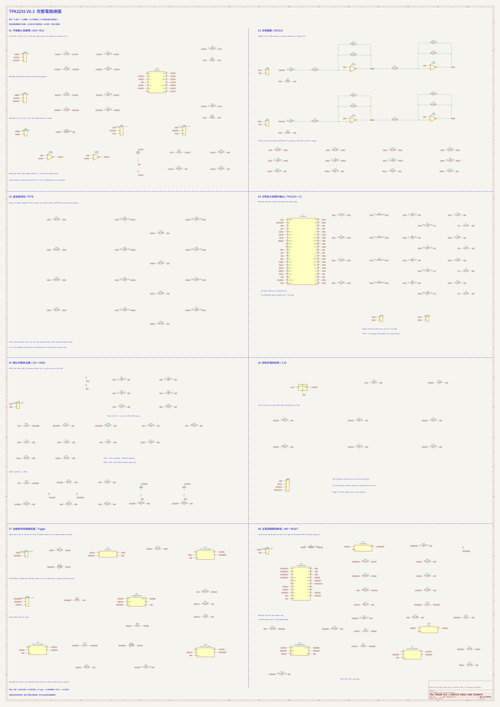

# V0.3 電路圖：完整單頁總圖

原八頁已合成 **一張 A0 直式總圖**，包含 XLR 平衡接收／RCA 選擇、PFFB、四顆 MA5172-AE，以及隔離 Trigger 控制與 48V 功率電源開關。180 個元件、483 個腳位、120 個網路與原版完全一致；這次只改排版。電路已有接線檢查及簡化模型驗證，亦有[未走線 PCB 配置草案](../pcb-draft/README.md)，尚無實機性能驗證。

整機採[機內電源、單一市電入口](../system-power/README.md)。總圖完整涵蓋原八頁的低壓音訊與控制；J201／J202 為機內供電接點，市電區另行規劃，沒有包含在本版 ERC／模型驗證內。

**[開啟／下載單頁 PDF](preview/tpa3255-v03-overview.pdf)** · [放大 SVG](preview/tpa3255-v03-overview.svg) · [高解析 PNG](preview/tpa3255-v03-overview.png) · [單頁 KiCad 圖檔](tpa3255-v03-overview.kicad_sch) · [合併檢查](overview-validation.md)



建議將單頁 PDF 傳給教授，放大看元件數值；列印以 A0 原尺寸為佳，縮到 A4 文字會太小。PDF／SVG 是可放大的向量圖；PNG 供快速預覽。同名網路標籤表示電氣相連。

總圖閱讀順序：

| 路徑 | 圖中分區 |
|---|---|
| 音樂訊號 | 01 XLR／RCA 選擇 → 02 NE5532 驅動 → 04 TPA3255／LC／喇叭 |
| 回授 | 04 輸出 → 03 PFFB → 02 輸入加總點 |
| 供電 | 05 類比供電／去耦、06 控制供電 |
| 啟停 | 07 Trigger → 08 主電源開關／RESET → 04 功率級 |

[中文設計說明](../../docs/V0.3_設計說明.md) · [電路／模型驗證](validation.md) · [BOM 草案](bom-draft.csv)

<details>
<summary>展開原八頁分區圖（維護與逐區查閱）</summary>

[下載原八頁 PDF](preview/tpa3255-v03.pdf)。以下頁次是原版次序，與上方總圖的分區編號不同。

## 1. 功率級與輸出電感


[放大 SVG](preview/tpa3255-v03.svg)

## 2. RCA 插座與選定訊號的差動驅動級

RCA 或 XLR 訊號由第八頁 J603／J604 選擇後，送入本頁的 C101／C121。


[放大 SVG](preview/tpa3255-v03-input.svg)

## 3. 供電去耦


[放大 SVG](preview/tpa3255-v03-power-control.svg)

## 4. 濾波後回授 PFFB


[放大 SVG](preview/tpa3255-v03-feedback.svg)

## 5. Trigger 接收與關機延遲


[放大 SVG](preview/tpa3255-v03-trigger.svg)

## 6. 48V 功率電源開關與延遲開聲


[放大 SVG](preview/tpa3255-v03-dc-switch.svg)

## 7. 待機控制供電


[放大 SVG](preview/tpa3255-v03-control-supply.svg)

## 8. XLR 平衡接收與輸入選擇


[放大 SVG](preview/tpa3255-v03-xlr-input.svg)

左右聲道各一個 XLR 母座。J603／J604 均接 2–3 選 XLR，均接 1–2 選 RCA；切換前先將 J302 設為 OFF 待機。這版是板上跳線設定，機殼面板切換方式尚待機構與靜音設計。

</details>

## 原始檔、編輯與驗證

單頁總圖可用 KiCad 10 開啟 [tpa3255-v03-overview.kicad_pro](tpa3255-v03-overview.kicad_pro)，它是包含全部元件的原生單頁圖檔。由現行八頁來源直接合併，保留元件、數值、符號 UUID 與實際接線。

維護時仍以八頁來源為準，再重建總圖。既有 PCB 對應原階層路徑，請繼續從原專案更新 PCB；總圖若另行編輯，不會自動回寫來源，重建也會覆寫總圖。`overview-sources.json` 記錄 SHA-256，驗證可偵測來源變動而總圖尚未更新。

只更新總圖時執行（不需重跑電路模型）：

```sh
python3 tools/build_schematic_overview.py
python3 tools/verify_schematic_overview.py
python3 tools/export_schematic.py electrical/v03/tpa3255-v03-overview.kicad_sch --pdf-from-svg --png-width 4800
```

PDF 由 KiCad 匯出的 SVG 轉為靜態向量圖，保留 A0 尺寸、中文與細節，方便傳閱。

KiCad 10 開啟 [tpa3255-v03.kicad_pro](tpa3255-v03.kicad_pro)，再開同名原理圖；自訂符號庫已隨附。電感料號已選，其餘 BOM 仍有待定項，全部 footprint 尚未定案。

在儲存庫根目錄執行：

```sh
python3 tools/verify_v03.py
python3 tools/export_schematic.py electrical/v03/tpa3255-v03.kicad_sch
```

`verify_v03.py` 檢查實際 KiCad 接線表，更新 BOM、AC 數據與控制時序規格模型。後者不是實際控制 IC 的 SPICE 模型，也沒有驗證真正的回授穩定裕度。

`tools/build_schematic_v03.py` 只供重建這版初始圖面，會覆寫本資料夾的原理圖、符號庫、預期接線表與專案檔。手動編輯後使用上述驗證與匯出指令，避免直接重建。V0.2 仍保留在[上層歷史圖面](../README.md)。
