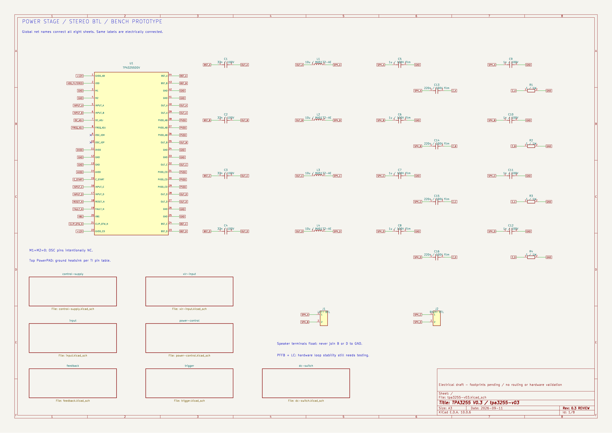
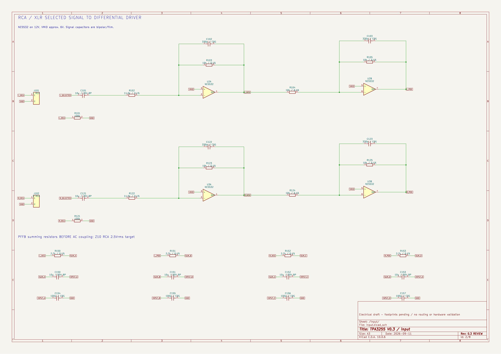
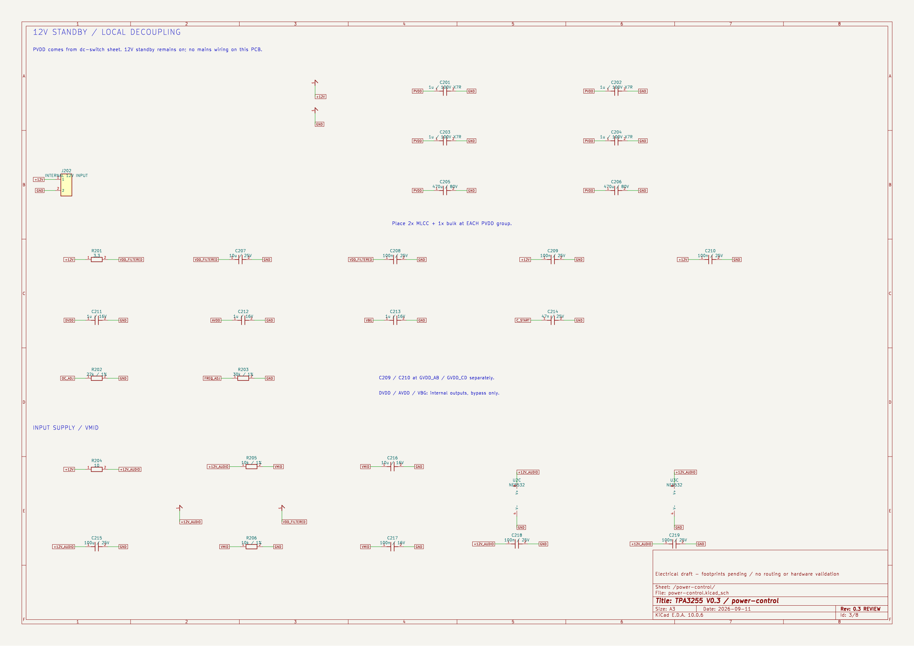
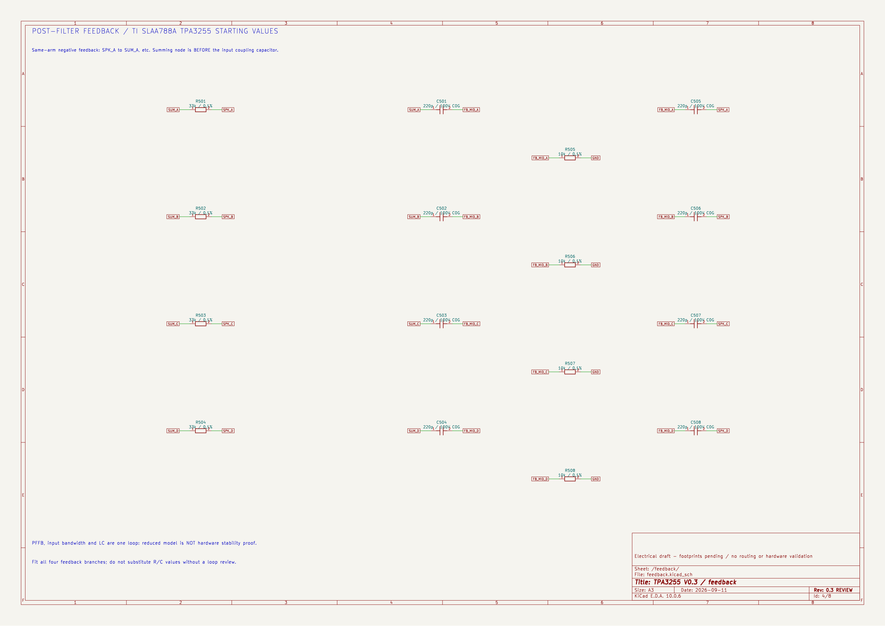
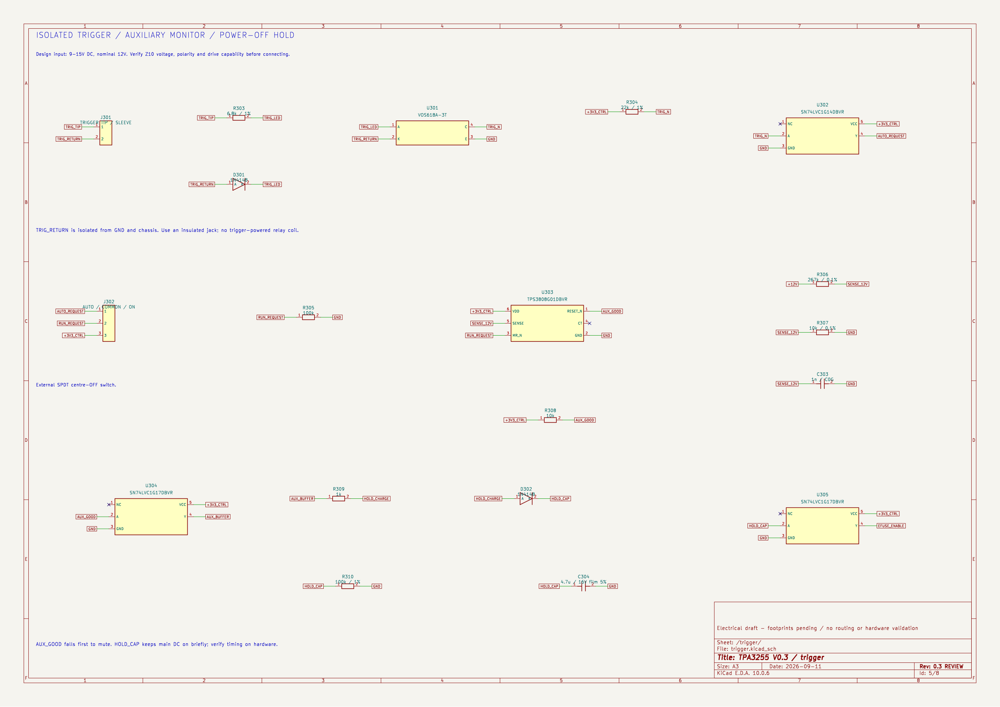
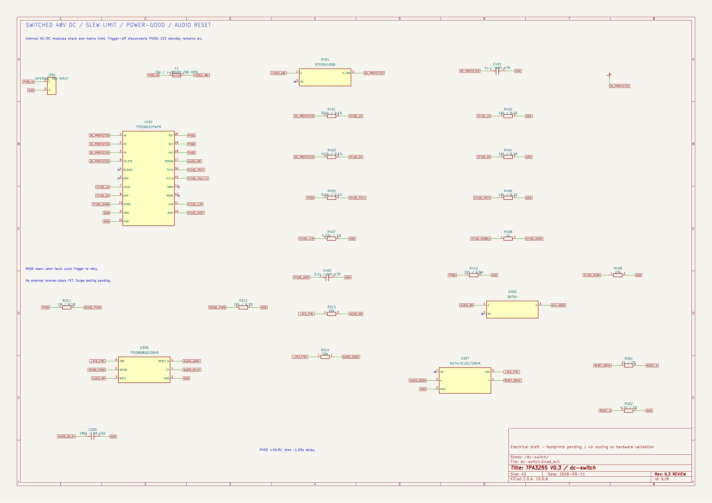
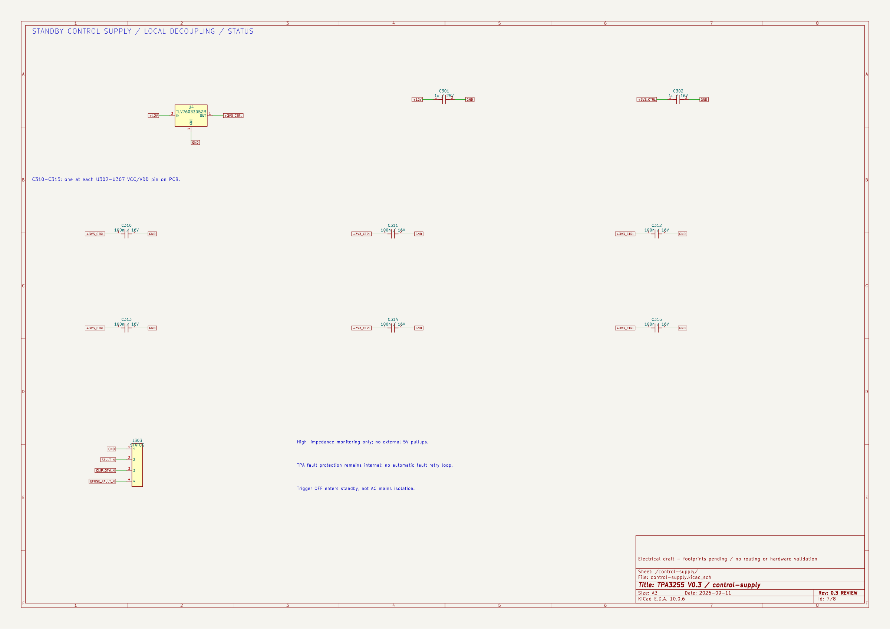

# V0.3 電路圖：XLR／RCA、音質改版與 Trigger 自動啟停

八頁同一電路，包含 XLR 平衡接收／RCA 選擇、PFFB、四顆 MA5172-AE，以及隔離 Trigger 控制與 48V 功率電源開關。已通過接線檢查及簡化模型驗證；已有[未走線 PCB 配置草案](../pcb-draft/README.md)，尚無實機性能驗證。D303 已依 BAT54 實體腳序改為 1=A、2=NC、3=K。

整機採[機內電源、單一市電入口](../system-power/README.md)。本資料夾八頁只包含低壓音訊與控制；J201／J202 為機內供電接點，市電區另行規劃，沒有包含在本版 ERC／模型驗證內。

**[下載八頁 PDF](preview/tpa3255-v03.pdf)** · [直接看 XLR 圖](preview/tpa3255-v03-xlr-input.png) · [中文設計說明](../../docs/V0.3_設計說明.md) · [驗證結果](validation.md) · [BOM 草案](bom-draft.csv)

## 1. 功率級與輸出電感



[放大 SVG](preview/tpa3255-v03.svg)

## 2. RCA 插座與選定訊號的差動驅動級

RCA 或 XLR 訊號由第八頁 J603／J604 選擇後，送入本頁的 C101／C121。



[放大 SVG](preview/tpa3255-v03-input.svg)

## 3. 供電去耦



[放大 SVG](preview/tpa3255-v03-power-control.svg)

## 4. 濾波後回授 PFFB



[放大 SVG](preview/tpa3255-v03-feedback.svg)

## 5. Trigger 接收與關機延遲



[放大 SVG](preview/tpa3255-v03-trigger.svg)

## 6. 48V 功率電源開關與延遲開聲



[放大 SVG](preview/tpa3255-v03-dc-switch.svg)

## 7. 待機控制供電



[放大 SVG](preview/tpa3255-v03-control-supply.svg)

## 8. XLR 平衡接收與輸入選擇


[放大 SVG](preview/tpa3255-v03-xlr-input.svg)

左右聲道各一個 XLR 母座。J603／J604 均接 2–3 選 XLR，均接 1–2 選 RCA；切換前先將 J302 設為 OFF 待機。這版是板上跳線設定，機殼面板切換方式尚待機構與靜音設計。

## 編輯與驗證

KiCad 10 開啟 [tpa3255-v03.kicad_pro](tpa3255-v03.kicad_pro)，再開同名原理圖；自訂符號庫已隨附。電感料號已選，其餘 BOM 仍有待定項，全部 footprint 尚未定案。

在儲存庫根目錄執行：

```sh
python3 tools/verify_v03.py
python3 tools/export_schematic.py electrical/v03/tpa3255-v03.kicad_sch
```

`verify_v03.py` 檢查實際 KiCad 接線表，更新 BOM、AC 數據與控制時序規格模型。後者不是實際控制 IC 的 SPICE 模型，也沒有驗證真正的回授穩定裕度。

`tools/build_schematic_v03.py` 只供重建這版初始圖面，會覆寫本資料夾的原理圖、符號庫、預期接線表與專案檔。手動編輯後使用上述驗證與匯出指令，避免直接重建。V0.2 仍保留在[上層歷史圖面](../README.md)。
