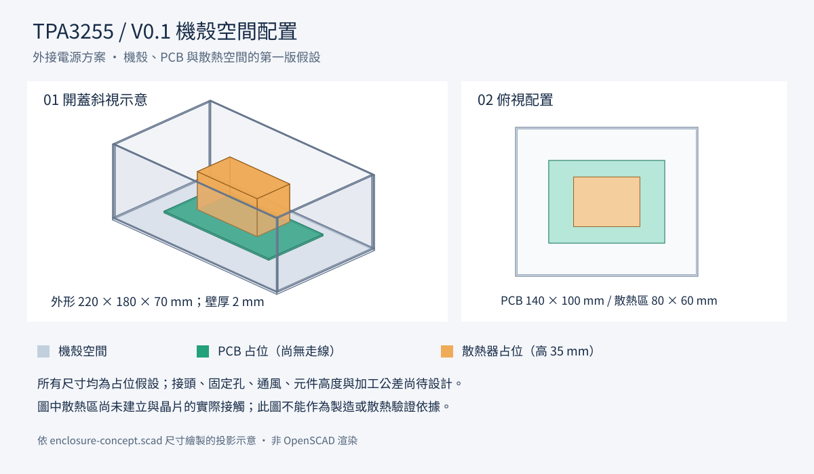

# 看圖入口

目前按使用者要求採 **機內電源、機背一條市電線**，見[整機電源架構圖](../electrical/system-power/README.md)。機箱建議採現成鋁殼＋客製前後板，已整理[製作方式與尺寸參考](機箱選擇.md)。型號與尺寸需重新配置；以下 V0.1 圖僅為外接電源時期的歷史占位，未包含現在的機內 AC/DC、XLR、實際電感及固定方式。

## 機殼草案



左側是開蓋斜視，右側是俯視。綠色是 PCB 占位，橘色是散熱器占位，灰色是機殼。這是空間配置草案；板上尚無元件與走線，尺寸仍可改。

- [放大看 PNG](enclosure-preview.png)
- [向量圖 SVG](enclosure-preview.svg)
- [可修改尺寸的 OpenSCAD 原始檔](enclosure-concept.scad)
- [系統方塊圖與設計規格](../docs/V0.1_設計規格.md#系統方塊圖)

GitHub 的文件與 PNG 可直接閱讀。若要旋轉並修改機殼模型，下載 `.scad`，用 [OpenSCAD](https://openscad.org/) 開啟並按 F5 預覽。本機目前尚未安裝 OpenSCAD；上述圖片是讀取模型尺寸繪製的投影示意，不是 CAD 軟體渲染。

## 更新預覽

在專案根目錄執行：

```sh
python3 tools/enclosure_preview.py
rsvg-convert -o mechanical/enclosure-preview.png mechanical/enclosure-preview.svg
```

Python 腳本不需要額外套件；PNG 轉換使用 librsvg 的 `rsvg-convert`。腳本讀取 SCAD 中的數值尺寸，投影邏輯對應目前的矩形空間配置。若更改 SCAD 的幾何形狀，需同步更新腳本。預覽固定隱藏上蓋，尚未輸出可旋轉的 STL。
